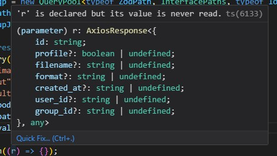

# rest-full

A Class oriented wrapper for the @bunnio/type-guardian, that enables the user to customize, and independently manage openapi endpoint (structures).

# CONSIDER AS _whatever comes before pre alpha_ VERSION

# USAGE

## Initialization

This package provides a class that expects 3 shaped values

(Openapi.interface,Openapi.zod,Openapi.lookup provided by @bunnio/type-guardian)


and provides a pre typed interface to properly use said Openapi specification.

The default **QueryPool** object is written for Axios, but you can easily change it to your preferred HTTP client.

An example intialization

```ts
import { QueryPool } from "@bunnio/rest-full/dist/QueryPool";
import { paths as ZodPath } from "./YourOpenapiSource.zod";
import { lookupJson } from "./YourOpenapiSource.lookup";
import { paths as InterfacePaths } from "./YourOpenapiSource.interface";
const qp = new QueryPool<typeof ZodPath, InterfacePaths, typeof lookupJson>(
  ZodPath,
  lookupJson
);
```

This will qp will act as a pretyped interface according to your specification, you can use as:

```ts
const response = qp.query(
  "/image/{image_id}", // path in openapi
  "put", // method defined in path
  "application/json", // body type if applicable or undefined <alias BodyKey>
  {}, // the actual body content or undefined <alias Content>
  {
    path: { image_id: "RandomStringId" },
  }, // every allowed <parameter> specified under <parameters> in openapi
  { validate: { requestBody: true } } // optional settings see below
);
```

Watch the magic happen:


## Path and method

The path and method supplied are pre typed, they will not allow any other combination than what is defined in the openapi

## BodyKey and Content

BodyKey and Content are defined by what is allowed in the openapi specification.
The default implementation of **QueryPool** can only parse application/json and multipart/form-data

If any other body shape is supplied, the QP will throw an error during execution.
To facilitate other parsers you may use the settings object during initialization:

```ts
const qp = new QueryPool<typeof ZodPath, InterfacePaths, typeof lookupJson>(
  ZodPath,
  lookupJson,
  {additionalBodyParser:{"multipart/mixed":(
        path, //: P,
        method, //: M,
        bodyKey, //: BodyKey,
        requestContent, //: Content,
        context, //: Context
        )=>{...your parser here}}}
);
```

You must adhere to format defined above, where every additional type must be matched with a parser function that has the standard inputs provided by **QueryPool**

- path,method, bodyKey, and requestContent are directly passed from original "query" call
- context is defined by two parts
- - The mandatory context supplied by the **QueryPool**
- - The optional context that can be initialized by contextMaker in the settings

The bodyParser is expected to fill out the appropriate fields in the context, see more at the context description

## Parameters

The parameters shape is matching to that provided by the type-guardian interface object,

```ts
interface Example {
  parameters: { path: { image_id: string } };
}
```

Each parameter object may contain any or none of the following groups: path,query,header,~~header~~.

```ts
interface Example {
  parameters?: {
    query: {
      search_id?: components["schemas"]["StringQueryBody"];
      mode_id?: components["schemas"]["StringQueryMode"];
      search_profile?: components["schemas"]["BoolQueryBody"];
      mode_profile?: components["schemas"]["BoolQueryMode"];
      search_filename?: components["schemas"]["StringQueryBody"];
      mode_filename?: components["schemas"]["StringQueryMode"];
      search_format?: components["schemas"]["StringQueryBody"];
      mode_format?: components["schemas"]["StringQueryMode"];
      search_created_at?: components["schemas"]["DateQueryBody"];
      mode_created_at?: components["schemas"]["DateQueryMode"];
      search_user_id?: components["schemas"]["StringQueryBody"];
      mode_user_id?: components["schemas"]["StringQueryMode"];
      search_group_id?: components["schemas"]["StringQueryBody"];
      mode_group_id?: components["schemas"]["StringQueryMode"];
    };
  };
}
```

As of now, cookies are not handled regardless if required or provided

The parameters are parsed based on the specification, with respect to their specified style and explode settings.

```ts
const mode = parameter.style ?? "simple"; // As default
const explode = parameter.explode ?? false; // As default
```

Unparsable parameters will throw an error, please refer to either openapi specification, or the src/parameter-tools files

A Path error example:

```ts
throw Error(
  `Path style must be one of "simple" | "label" | "matrix"! is ${mode}`
);
```

## Additional settings

### Validator

The zod validators may be called via specifying which validators you want to use in the validators object.


The validator object can only contain values that are provided in the previous steps, the type hints should help you call any available validators

Validators are run before the context gets built, and are strictly called only at values submitted.

In general it's best practise to use validators BEFORE calling query, see **Zod integration** tools

### Expected Result Type

The value expectedResultType may contain which response shape you expect,
_such as **application/json**, **multipart/form-data**_
if multiple is defined in the responses object of the operation.
This is purely used to set the proper response shape.

## Responses

The response shape is based on the method type, and responses defined in the openapi.
by default

```ts
type GetKeys = Pick<PathObject, "get" | "options" | "head">; //-> expects 200 first but checks 201 if available
type PutKeys = Pick<PathObject, "delete" | "patch" | "put">; //-> expects 200 first but checks 201 if available
type PostKeys = Pick<PathObject, "post">; //->expects 201 first but checks 200 if available
```

the current implementation of response type **can not** distuingish between supported and not supported response types.

Defintions like:

with content:

will translate to:


Axios by default decodes json response, but any other expected response must be decoded by the programmer

I am currently working on a standardized approach, to enable response parsing, but for now, be aware of this limitation

# QueryPool.query and Context

Every time a **query** is called, the function creates a context, which then gets filled with every information the query may need.

## Setting up context

The context shape can be extended by the user via specifing contextMaker in the constructor settings.

The context must contain elements like,

```ts
type context<Body> = {
  requestData: Body & { url: string };
  queryParameterChain: string[];
  headers: [string, string][];
  lookup: {
    path: DeepReadonly<PathObject>;
    rootSecurity?: DeepReadonly<YAMLDocumentStructure["security"]>;
    OperationObject: DeepReadonly<OperationObject>;
  };
  method: keyof Pick<
    PathObject,
    "get" | "delete" | "options" | "patch" | "post" | "put" | "trace" | "head"
  >;
};
```

however, the **contextMaker gets all this information as a single argument**, so you only need to append with whatever extra information you might want

```ts
{contextMaker?: (starter: DefaultContext<Body>) => Context;}
```

## Context building

A context is created at the beginning of the request and every tool builds it during it's lifespan.

- **bodyParsers** are expected to fill out **requestData.data** filled (requestData extends AxiosRequestConfig)
- **path parameters** are replacing the **requestData.url** like /image/{image_id}-> /image/123123
- **query parameters** are pushing their \[key, value\] pairs to **queryParameterChain**
- **headers** are being defined as \[key, value\] pairs in **headers**
- security functions have no designated context fields, they are expected to fill out their respective headers or query parameters, or data fields

## Context consuming

The axios request gets created in the execute function, which only has a single input, and that is the context.

```ts
function execute<
   ...
  >(
    context: Context
  ): AxiosPromise<ResponseFinder<Responses, M>[ExpectedResType]>{...}
```

By the time the _execute_ function gets called the context should be fully built

Afther the execution the context is considered consumed, and will be thrown away.

# Security

There is no default behaviour for security, but there is two hook provided for security operations.

## Global security

The QP constructor options may contain a globalSecurityHandler, which will be called for every security defined in the openapi root security object.

At every call you only get one security schema, but you can see other keys defined in fullSecurity if available.

```ts
funcion globalSecurityHandler (
        security: DeepReadonly<SecuritySchema>,
        scopes: DeepReadonly<string[]>,
        name: string,
        fullSecurity: DeepReadonly<SecurityRequirements>,
        context: Context
      ) => {};
```

To understand **"&"** and **"|"** behaviors in security in openapi, please refer to the openapi specification.
SecuritySchema, and SecurityRequirements are exact values from the lookUpJson, which is direct translation of the original openapi

It is expected of the programmer to fill out the required context fields when handling security

## Local security

Local security works exactly as global security does.

```ts
funcion lookupSecurityHandler(
        security: DeepReadonly<SecuritySchema>,
        scopes: DeepReadonly<string[]>,
        name: string,
        fullSecurity: DeepReadonly<SecurityRequirements>,
        context: Context
      ) => {};
```

## Priority

If global security is defined, it gets called first

Local security is called last, so you may overwrite or delete any security set in the global security

## Best practices

Since **QueryPool** calls the context creator, and the security tools on demand, it is best if you use these handlers to connect your security information with any other state manager you may use.

If your security measures do not change often it might be best if you use the context creator to always ensure your api key/bearer token is set.

Otherwise its best to expose a function in your security flow,that can always access the latest security tokens and then supply it as a security handler

# Zod integration

The **QueryPool** currently supports 2+1 Zod Schema retriever.

- getBodyZod
- **getPathZod**
- getParameterZod

it is highly recommended that you use getPathZod, as it retrieves the full zod specification and you can cherry pick which objects you want to use.

type-guardian keeps a very simple structure for defining zod schemas

## requestBody

One of the values retrieved by **getPathZod** can be _requestBodies_ if applicable.
In _requestBodies_ you can expect to find every schema defined in you openapi as
\[_mediaType_\]:**ZodSchema**

This also means that you may need to break up the zod definitions, for example if you are sending _multipart/form-data_

_You can use z.infer to make typing easier_

```ts
const fullZod = qp.getPathZod("/image/with_files", "post");
type ZodStuff = z.infer<(typeof fullZod)["requestBody"]["multipart/form-data"]>;
```

## parameters

Parameters match their interface counterpart, and are slightly different than your openapi definitions.

Parameters are aggregated into four categories

- **query**
- **path**
- **headers**
- ~~cookies~~
- - cookies are available but the query will disregard it for now

Each category is a _key_->**ZodSchema** pair, that you can use to parse the parameter

# Additional settings, tools available

## YamlNavigator

A yaml navigator is included in the **QueryPool**.

This object ensures, that every entry that is passed through the layers are the actual component, and not just a $ref,
_...at least at root level_

## silentError (default false)

You can silence _some_ errors by setting silentError to true.
This mostly affects zod lookups, when the zod validator is not found.

Silent errors will still log, but not throw an actual error

## strictEncoding (default false)

Multipart/\* requests may have an additional encoding parameter at the schema level.

This can ensure that all keys are encoded appropriately

The current behaviour is that top level components that are simple string type, or simple string arrays, with format:binary are expected to be files

Any other field is expected to be json

if strictEncoding is set to true, this must be also specified in the encoding section of the openapi

## warnOnCookies (default false)

Whether to omit a console log stating that cookies are not supported, when cookies are encountered

## throwOnSecurityMissing (default true)

Whether to throw an error if a security is defined in the openapi, but the actual specification (in components) was not found, hence it wasn't executed

## defaultSettings

Either a const settings that gets set at every context creation for the value requestData, or a function that returns an AxiosRequestConfig or something that extends AxiosRequestConfig
